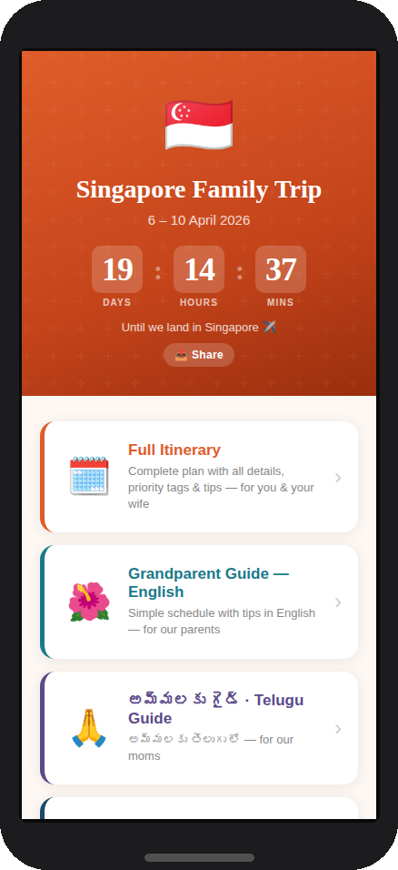
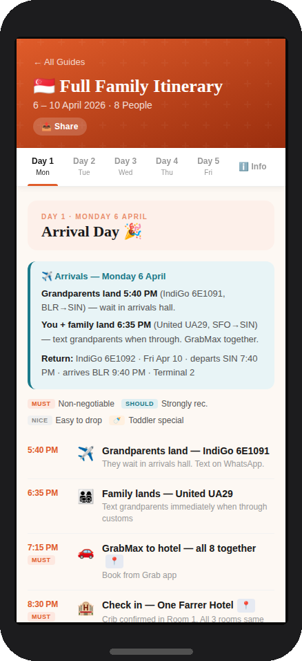
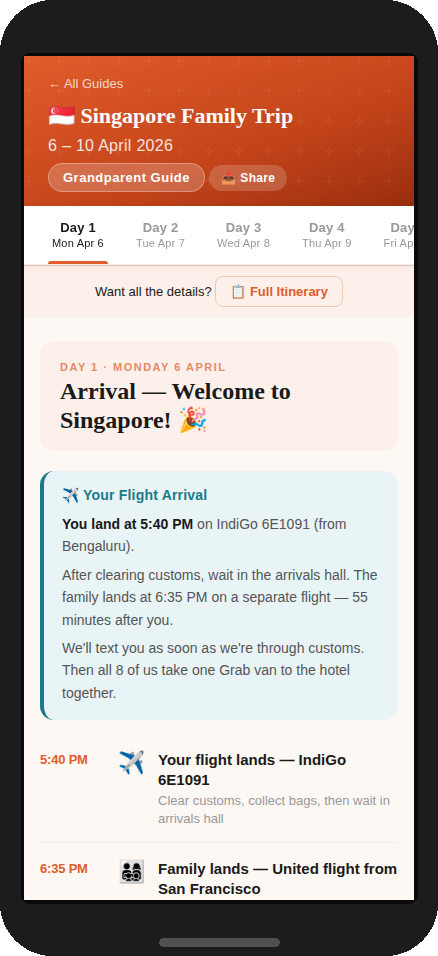
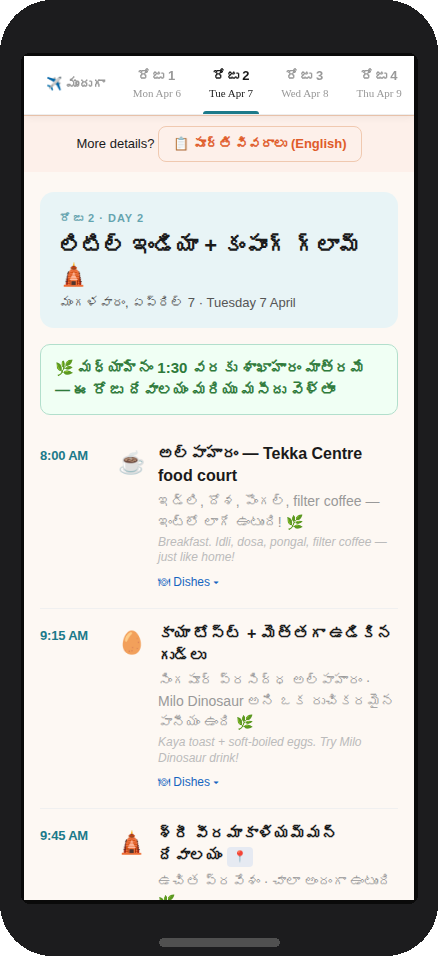
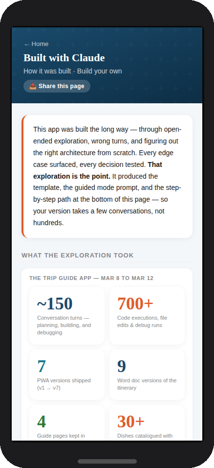
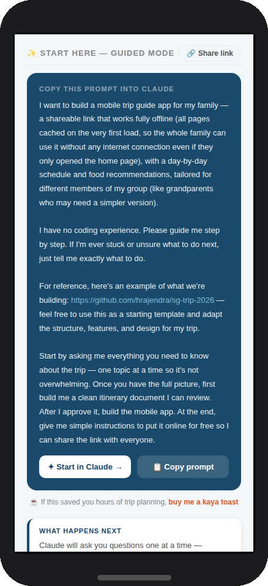

# 🇸🇬 Singapore Family Trip PWA — April 2026


**Live site:** [hrajendra.github.io/sg-trip-2026](https://hrajendra.github.io/sg-trip-2026)

[](https://ko-fi.com/hrajendra)

**[✦ Build your own trip guide with Claude →](https://claude.ai/new?q=I%20want%20to%20build%20a%20mobile%20trip%20guide%20app%20for%20my%20family%20%E2%80%94%20a%20shareable%20link%20that%20works%20fully%20offline%20%28all%20pages%20cached%20on%20the%20very%20first%20load%2C%20so%20the%20whole%20family%20can%20use%20it%20without%20any%20internet%20connection%20even%20if%20they%20only%20opened%20the%20home%20page%29%2C%20with%20a%20day-by-day%20schedule%20and%20food%20recommendations%2C%20tailored%20for%20different%20members%20of%20my%20group%20%28like%20grandparents%20who%20may%20need%20a%20simpler%20version%29.%0A%0AI%20have%20no%20coding%20experience.%20Please%20guide%20me%20step%20by%20step.%20If%20I%27m%20ever%20stuck%20or%20unsure%20what%20to%20do%20next%2C%20just%20tell%20me%20exactly%20what%20to%20do.%0A%0AFor%20reference%2C%20here%27s%20an%20example%20of%20what%20we%27re%20building%3A%20https%3A//github.com/hrajendra/sg-trip-2026%20%E2%80%94%20feel%20free%20to%20use%20this%20as%20a%20starting%20template%20and%20adapt%20the%20structure%2C%20features%2C%20and%20design%20for%20my%20trip.%0A%0AStart%20by%20asking%20me%20everything%20you%20need%20to%20know%20about%20the%20trip%20%E2%80%94%20one%20topic%20at%20a%20time%20so%20it%27s%20not%20overwhelming.%20Once%20you%20have%20the%20full%20picture%2C%20first%20build%20me%20a%20clean%20itinerary%20document%20I%20can%20review.%20After%20I%20approve%20it%2C%20build%20the%20mobile%20app.%20At%20the%20end%2C%20give%20me%20simple%20instructions%20to%20put%20it%20online%20for%20free%20so%20I%20can%20share%20the%20link%20with%20everyone.)**

A mobile-first Progressive Web App built as a personal trip guide for a multigenerational family trip to Singapore — 8 people across three generations, 5 days, April 6–10 2026.

The app was entirely designed, written, and iterated with [Claude](https://claude.ai) over a series of conversations — no prior web development was needed. It's shared here as a template and starting point for anyone who wants to build something similar for their own trip.

---

## 📱 Screenshots

<table>
  <tr>
    <td align="center"><br><sub>Home · countdown + share</sub></td>
    <td align="center"><br><sub>Full itinerary · Day 1</sub></td>
    <td align="center"><br><sub>Grandparent guide (English)</sub></td>
  </tr>
  <tr>
    <td align="center"><br><sub>Grandparent guide (Telugu)</sub></td>
    <td align="center"><br><sub>Built with Claude · stats</sub></td>
    <td align="center"><br><sub>Guided mode · start in Claude</sub></td>
  </tr>
</table>

---

## ✨ What this app is

Most travel planning lives in a mess of tabs, PDFs, and WhatsApp threads. This app replaces all of that with a single link you can share with everyone in your group — each person gets a view tailored to them. It works fully offline (no signal needed at temples, beaches, or airports), installs on home screens as its own icon, and has a share button on every page.

The specific problem it solves: **multigenerational travel** where different members of the group have very different needs. Parents want every detail. Grandparents want to know where to be and when, in language they can read. Young children have dietary restrictions. Everyone needs the same trip, but communicated differently.

**What makes it different from a shared Google Doc:**
- Works fully offline after first load — no signal needed at temples, beaches, or airports
- Installable on iPhone and Android home screens as its own app icon
- Tailored views per audience — grandparents never see the detailed logistics, parents never lose them in a simplified guide
- Food and drinks are curated by dietary needs (vegetarian, toddler-safe, added sugar flags) with specific stall numbers at hawker centres
- Countdown timer on the home screen — the grandparents love watching it tick down

---

## 📋 Features

- **Countdown timer** — live days/hours/mins countdown to arrival, switches to hours/mins/secs under 24 hrs, disappears once the trip begins
- **Five pages** — home with countdown, full adult itinerary, English grandparent guide, Telugu grandparent guide, and a "Built with Claude" page with guided mode for others to build their own
- **Tab navigation** — Days 1–5, Places, Food, Info (and Apps tab in the full guide)
- **Dish toggles** — every hawker centre and restaurant has a collapsible dish list with stall numbers, dietary tags (🌿 🍗 👶 🍼 ⭐), and sugar flags
- **Single source of truth** — `dishes.js` powers dish lists across all three guide pages; update once, all pages reflect it
- **Offline-first PWA** — service worker pre-caches all pages on install; works without any internet after first load, even pages not yet visited
- **Installable** — full `manifest.json` with custom hibiscus icon, works on iOS Safari and Android Chrome
- **Share buttons** — every page has a native share button; opens the share sheet on mobile (WhatsApp, iMessage, etc.) or copies link to clipboard with a toast on desktop
- **Cultural dietary rules** — vegetarian-only flags before temple visits baked into the schedule notes
- **Places & Food tabs** — separate reference tabs for all venues (with opening hours) and all food/drink recommendations
- **Telugu guide** — full translation with English subtitles for non-Telugu readers in the group

---

## 📲 Usage

### Adding to your home screen (iPhone)
1. Open the guide link in **Safari** (not Chrome)
2. Tap the **Share** button (box with arrow)
3. Tap **Add to Home Screen**
4. Each guide installs as its own icon

### Adding to your home screen (Android)
1. Open the link in **Chrome**
2. Tap the three-dot menu
3. Tap **Add to Home Screen** or **Install App**

### Updating content while travelling
The site is hosted on GitHub Pages. To make a quick change:
1. Open the repo on github.com on any device
2. Tap the file you want to edit
3. Tap the **pencil icon**
4. Edit and tap **Commit changes**

The live site updates in ~60 seconds. Everyone just pulls to refresh.

---

## 🛠 For developers

### Architecture

The app is intentionally simple — no framework, no build step, no dependencies. Just HTML, CSS, and vanilla JavaScript, hosted on GitHub Pages.

```
index.html          Landing page + countdown timer
full.html           Full adult itinerary
gp-en.html          English grandparent guide
gp-te.html          Telugu grandparent guide
dishes.js           Shared dish/drink data (single source of truth)
manifest.json       PWA config (name, icon, theme colour, start URL)
sw.js               Service worker (cache-first for app assets, offline after first load)
icon-192.png        Home screen icon — 192×192
icon-512.png        Home screen icon — 512×512
docs/               README assets (screenshots, icon)
```

### Key design decisions

**`dishes.js` as shared data layer** — Every dish list across all three HTML pages is driven by a single JavaScript file. Each stall/restaurant has a key (e.g. `chinatown_complex`), and pages declare `data-dishes="chinatown_complex"` on any slot element. The script injects the rendered toggle + list at `DOMContentLoaded`. To update a dish or add a stall number, you edit one file and all three pages update.

**No framework** — The tab navigation, section toggling, and dish toggles are ~20 lines of vanilla JS each. This makes the files easy to edit directly on GitHub without a local environment, which matters when you're making last-minute updates from your phone at the airport.

**Separate pages per audience** — Rather than one page with a toggle, each audience gets a fully self-contained HTML file. This means each guide can be bookmarked, installed, and shared independently. Grandparents never need to see a "switch view" option.

**CSS custom properties** — Colours, spacing, and type are set via CSS variables at the top of each file, making it straightforward to retheme for a different trip.

### Running locally

No server needed for most editing — just open the HTML files in a browser directly. For service worker testing, use a simple local server:

```bash
cd sg-trip-2026
python3 -m http.server 8000
# Open http://localhost:8000
```

### GitHub Pages deployment

1. Push to the `main` branch
2. Go to repo **Settings → Pages**
3. Set source to `main` branch, root folder `/`
4. The site is live at `https://<username>.github.io/<repo-name>/`

The `manifest.json` uses `"start_url": "./index.html"` and `"scope": "./"` — this is required for PWA installability on GitHub Pages since the app lives in a subdirectory, not the root.

---

## 🤖 Build your own with Claude

This entire app was built the long way — through open-ended exploration, wrong turns, and figuring out the right architecture from scratch. Every edge case surfaced, every decision tested across 10 days, 6 active sessions, ~240 conversation turns, and ~1,000 tool calls — from "help me plan a trip to Singapore" to a fully offline installable PWA with multilingual guides, dietary-tagged food lists, and a share button on every page. Zero lines of code written by hand.

**That exploration is the point.** It produced the template, the guided mode prompt, and the step-by-step path below — so your version takes a few conversations, not hundreds.

This entire app was built through conversation with Claude — no code was written by hand. The full story, stats, retrospective, and guided mode for building your own is in **[build.html](https://hrajendra.github.io/sg-trip-2026/build.html)** — linked from the app home screen.

The fastest way to start: **[✦ Open guided mode in Claude](https://hrajendra.github.io/sg-trip-2026/build.html#guided-mode)** — a pre-filled prompt that kicks off a step-by-step conversation to build your own trip guide. Or go straight to Claude with the prompt: [claude.ai/new](https://claude.ai/new).

---

## 📁 Files

| File | Purpose |
|------|---------|
| `index.html` | Landing page with countdown timer |
| `full.html` | Full adult itinerary — all days, info, places, food, apps |
| `gp-en.html` | English grandparent guide |
| `gp-te.html` | Telugu grandparent guide |
| `build.html` | How this was built + guide for building your own |
| `dishes.js` | Shared data layer — all dish/drink/stall lists |
| `manifest.json` | PWA config |
| `sw.js` | Service worker — offline support |
| `icon-192.png` | App icon 192×192 |
| `icon-512.png` | App icon 512×512 |
| `docs/` | README screenshots and assets |

---

*Built with ❤️ for the family — and [Claude](https://claude.ai).*
